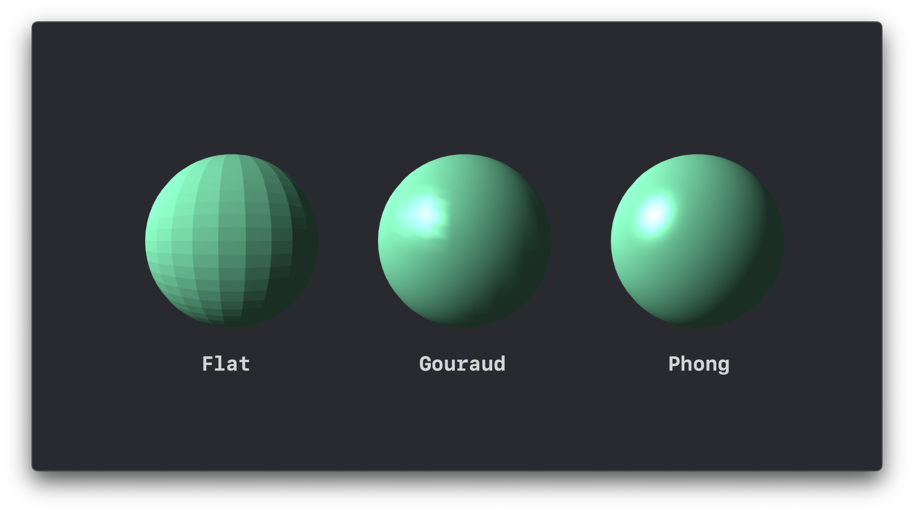
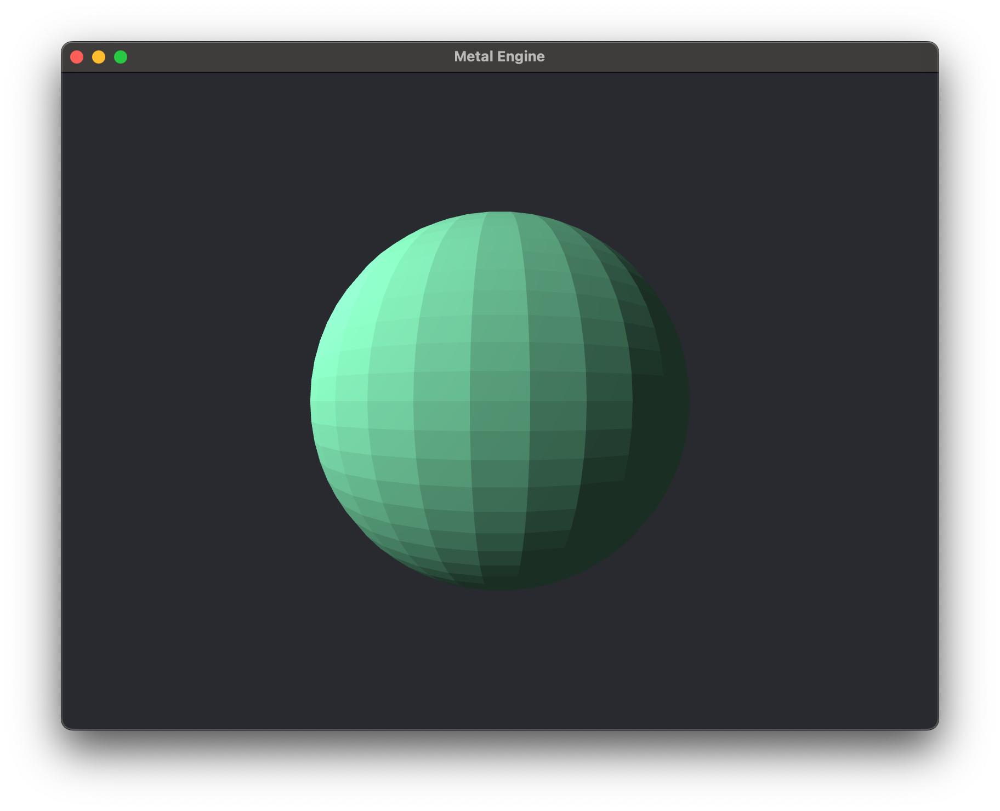
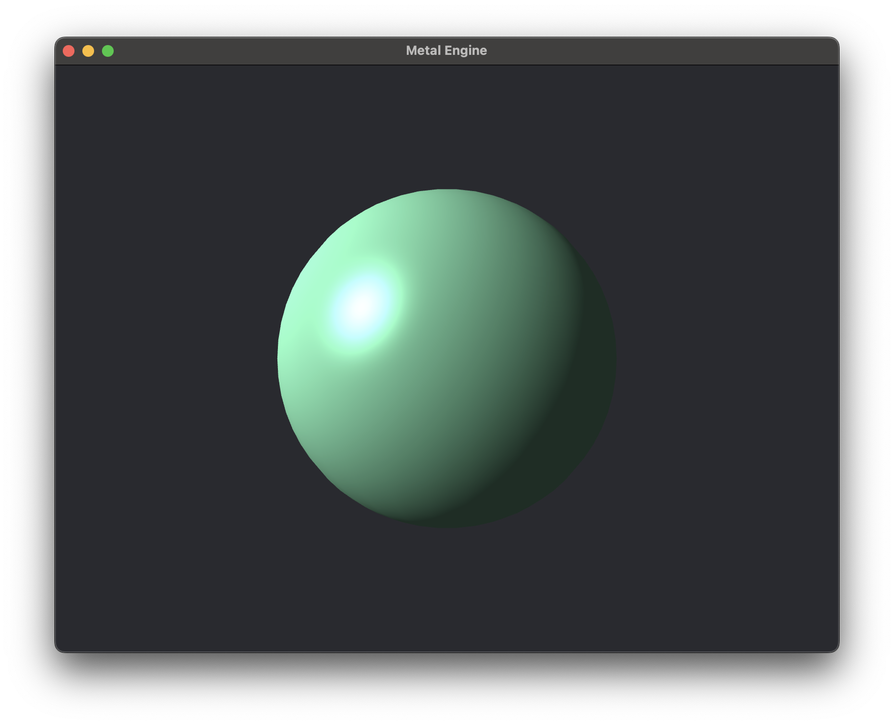

# Lighting

Lighting in Computer Graphics is a fascinating topic. To start, let's briefly discuss some of the major shading models that exist within Computer Graphics:

## Shading Models
1. Flat Shading
2. Gouraud Shading
3. Phong Shading
4. Blinn-Phong Shading
5. Deferred Shading
6. Phsyically Based Rendering (PBR)
7. Ray-Tracing

### Flat vs Gouraud vs Phong Shading

### Flat Shading
Flat shading is the most basic form of shading in Computer Graphics.

### Gouraud Shading
...

### Phong Shading
...

Full write-up soon to come! For now, the code is accessible on the [GitHub repository](https://github.com/wmarti/MetalTutorial/) under branch Lesson_2_2, and here is the finished product:

